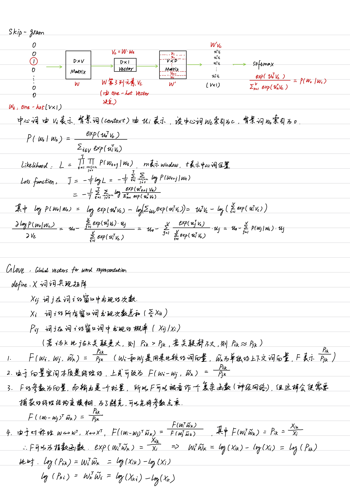
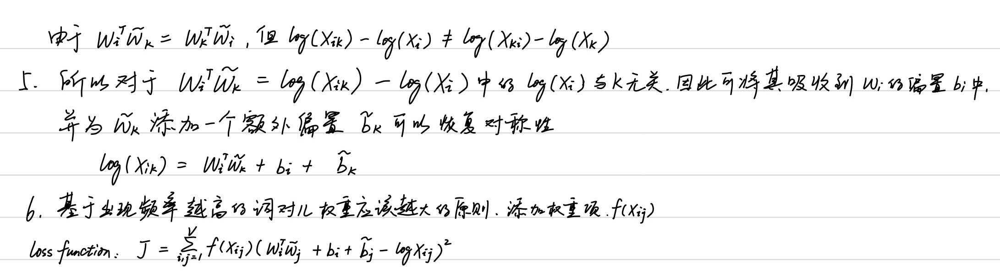

### skip-gram 和 GloVe 的理解及推导过程
word2vec和glove是两个经典的词向量模型，word2vec来源于2013年的论文[《Efficient Estimation of Word Representations in Vector Space》](https://arxiv.org/pdf/1301.3781.pdf)，它的核心思想是通过词的上下文得到词的向量化表示，有两种方法：CBOW（通过附近词预测中心词）、Skip-gram（通过中心词预测附近的词）。word2vec只考虑到了词的局部信息，没有考虑到词与局部窗口外词的联系，glove利用共现矩阵，同时考虑了局部信息和整体的信息。来自论文[《Glove: Global vectors for word representation》](https://www.aclweb.org/anthology/D14-1162.pdf)。

以下是两种模型的理解及推导过程：

