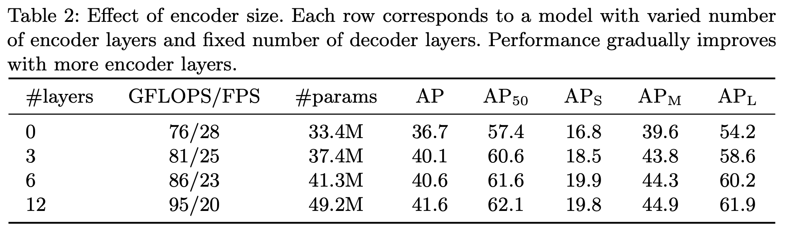

## Title: End-to-End Object Detection with Transformers

## Link:

[https://arxiv.org/pdf/2005.12872.pdf](https://arxiv.org/pdf/2005.12872.pdf)

## Github:
[https://github.com/facebookresearch/detr](https://github.com/facebookresearch/detr)


## 1. Transformer

### 1.1 整体结构
Transformer是2017年NIPS上的文章，题目为[Attention is All You Need](https://papers.nips.cc/paper/2017/file/3f5ee243547dee91fbd053c1c4a845aa-Paper.pdf)。它使用attention组成了encoder-decoder的框架，并将其用于机器翻译。它的大致结构如下：


### 1.2 Encoder
首先通过Word2Vec等词嵌入方法将输入语料转化成特征向量，在最底层的Encoder中， 词嵌入将直接作为它的输入，而在其他Encoder中，输入则是上一个Encoder的输出。


##### Self-Attention
计算公式：
$$Attention(Q,K,V)=softmax(\frac{QK^T}{\sqrt{d_k}})V$$


第一步：
在self-attention中，每个单词都对应了3个不同的向量，它们分别是Query向量（ $Q$），Key向量（ $K$）和Value向量（ $V$）。它们通过嵌入向量$X$乘以三个不同的权值矩阵$W^Q$，$W^K$，$W^V$得到。


第二步：
对输入句子的每个单词进行评分，这个分数决定了对其他单词放置多少关注度。假设为这个例子中的第一个词“Thinking”打分，这些分数是通过所有输入句子的单词的K向量与“Thinking”的Q向量相点积来计算的。
将分数除以K向量的维数的平方根，这会让梯度更稳定；softmax的作用是使所有单词的分数归一化


第三步：
第五步是将每个V向量乘以softmax分数，以保持所要关注的单词的值的完整并淹没无关的单词。最后将它们相加


矩阵形式：


### 1.3 Positional Encoding
只有Encoder并没有捕捉顺序序列的能力，也就是说无论句子的结构怎么打乱，都会得到类似的结果。为了解决这个问题，论文中在编码词向量时引入了位置编码（Position Embedding）的特征。具体地说，位置编码会在词向量中加入了单词的位置信息，通常位置编码是一个长度为$d_{model}$的特征向量，这样便于和词向量进行单位加的操作
计算公式：
$$PE(pos,2i)=\sin(\frac{pos}{10000^{\displaystyle\frac{2i}{d_{model}}}})$$
$$PE(pos,2i+1)=\cos(\frac{pos}{10000^{\displaystyle\frac{2i}{d_{model}}}})$$
上式中，$pos$指的是这个word在句子中的位置，$2i$表示embedding词向量的偶数维度，$2i+1$表示embedding 词向量的奇数维度。

好处：
1. 不仅考虑到了绝对位置，而且也考虑到了相对位置（同一序列的不同单词在单个纬度符合某个正弦或者余弦，可认为他们的具有相对关系）。任意位置的$PE_{pos+k}$都可以被$PE_{pos}$的线性函数表示:
$$\sin(pos+k)=\sin(pos)\cos k+\sin(pos)\cos k$$
$$\cos(pos+k)=\cos(pos)\cos k-\sin(pos)\sin k$$

2. 三角公式不受序列长度的限制

### 1.4 Decoder
1. 将最上面的Encoder的输出变换成一组attention矩阵K和V，用于每个decoder的 Multi-Head Attention层。
每个time step的输出都在下一个time step重新输入到最底部的 decoder，同样，在这些 decoder 的输入中也加入了位置编码，来表示每个字的位置。


2. Decoder中的 self attention 层与Encoder中的略有不同
（1）在Decoder中，在self attention 的softmax 步骤之前，将未来的位置设置为 -inf 来屏蔽这些位置，这样做是为了self attention层只能关注输出序列中靠前的一些位置。
（2）Decoder中的Multi-Head Attention 层的工作方式与Encoder中的Multi-Head Attention类似，只是它用下面的层创建Query矩阵，从Encoder的输出中获取Key和Value矩阵。

3. Decoder最后输出的是一个向量，通过一个全连接线性层（输出维度为Vocabulary中所包含单词的数量），最后通过softmax层将softmax层将这个分数转换为了概率，选择概率最大的所对应的单词，就是当前time step的输出。


## 2. Detection with Transformers-DETR

### 2.1 整体结构
将目标检测任务转化为一个序列预测（set prediction）的任务，使用transformer结构和双边匹配的方法，由输入图像直接得到预测结果序列。
Backbone + Encoder + Decoder + Prediction Heads


### 2.2 DETR’s Transformer
输出：DETR输出是定长的（100个检测框和类别）
Encoder：网络一开始是使用Backbone（比如ResNet）提取feature，降维后送入Encoder
Decoder：Object Query是一组nn.Embedding的weight（N个emebding），告诉模型要100个实例，然后decoder根据encoder得到特征的位置和显著性解码出N个Query代表instance


### 2.3 Spatial Positional Encoding
将CNN提取的特征送入到transformer中，为了保持位置信息，也要送入位置的编码信息，确保整个链路中位置信息不丢失。作者的代码里分别计算了x和y维度的Positional Encoding。
```python
pos_x = torch.stack((pos_x[:, :, :, 0::2].sin(), pos_x[:, :, :, 1::2].cos()), dim=4).flatten(3)
pos_y = torch.stack((pos_y[:, :, :, 0::2].sin(), pos_y[:, :, :, 1::2].cos()), dim=4).flatten(3)
pos = torch.cat((pos_y, pos_x), dim=3).permute(0, 3, 1, 2)
```
### 2.4 模型的损失函数
基于序列预测的思想，作者将网络的预测结果看作一个长度为N的固定顺序序列$\widehat y:\widehat{y}_i$（其中N值固定，且远大于图中ground truth目标的数量），同时将ground truth也看作一个序列$y:y_i=(c_i,b_i)$（用$\varnothing$对该序列进行填充，可理解为背景类别，使其长度等于N），其中$c_i$表示该目标所属真实类别，$b_i$表示目标框的中心点坐标和宽高。那么预测任务就可以看作是$y$与$\widehat y$之间的二分匹配问题。

求最小损失时的匹配策略$\widehat\sigma$

$c_i$的预测类别置信度为$\widehat{P}_{\sigma(i)}(c_i)$,边界框预测为$\widehat{b}_i$:

Bounding box loss：L1 loss + GIoU（Generalized intersection over union）loss


### 2.5 实验
(1) 性能对比：效果与经典方法Faster RCNN不相上下，其中DETR对于大目标的检测效果有所提升，但在小目标的检测中表现较差。


(2) 测试Encoder和Decoder的层数



(3) 测试不同的Positional Encoding


(4) 测试Loss Fuction


## Reference
1. [Carion N, Massa F, Synnaeve G, et al. End-to-End Object Detection with Transformers[J]. arXiv preprint arXiv:2005.12872, 2020.](https://arxiv.org/pdf/2005.12872.pdf)
2. [https://jalammar.github.io/illustrated-transformer/](https://jalammar.github.io/illustrated-transformer/)
3. [https://zhuanlan.zhihu.com/p/144974069](https://zhuanlan.zhihu.com/p/144974069)