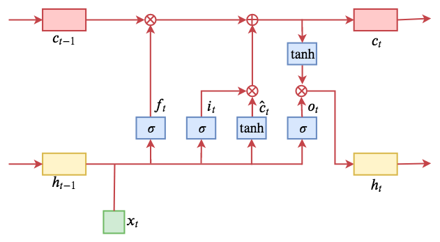
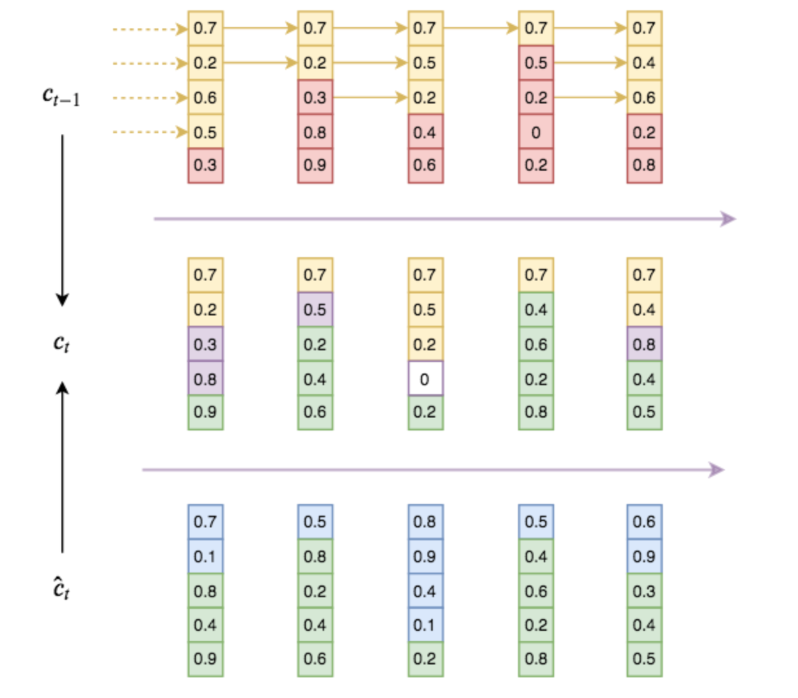
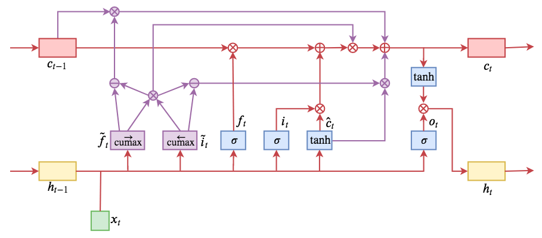

## Title: Ordered Neurons: Integrating Tree Structures into Recurrent Neural Networks

### Link:
#### [https://arxiv.org/pdf/1810.09536.pdf](https://arxiv.org/pdf/1810.09536.pdf)

### Github:
#### [https://github.com/yikangshen/Ordered-Neurons](https://github.com/yikangshen/Ordered-Neurons)

### 1. 背景
ON-LSTM，其中“ON”的全称是“Ordered Neurons”，即有序神经元，换句话说这种LSTM内部的神经元是经过特定排序的，从而能够表达更丰富的信息。将神经元经过特定排序是为了将层级结构（树结构）整合到LSTM中去，从而允许LSTM能自动学习到层级结构信息。这篇论文还有另一个身份：ICLR 2019的两篇最佳论文之一，这表明在神经网络中融合层级结构（而不是纯粹简单地全向链接）是很多学者共同感兴趣的课题。它除了提高了语言模型的效果之外，还可以无监督地学习到句子的句法结构。

#### 普通LSTM
$$\begin{equation}\begin{aligned} f_{t} & = \sigma \left( W_{f} x_{t} + U_{f} h_{t - 1} + b_{f} \right) \\\\ 
i_{t} & = \sigma \left( W_{i} x_{t} + U_{i} h_{t - 1} + b_{i} \right) \\\\ 
o_{t} & = \sigma \left( W_{o} x_{t} + U_{o} h_{t - 1} + b_{o} \right) \\\\
\hat{c}_t & = \tanh \left( W_{c} x_{t} + U_{c} h_{t - 1} + b_{c} \right)\\\\ 
c_{t} & = f_{t} \circ c_{t - 1} + i_{t} \circ \hat{c}_t  \\\\ 
h_{t} & = o_{t} \circ \tanh \left( c_{t} \right)\end{aligned}\end{equation}$$

$f_t, i_t, o_t$是三个单层全连接模型，输入是历史信息$h_{t−1}$和当前信息$x_t$，用sigmoid激活，因为sigmoid的结果在0～1之间，所以它们的含义可以诠释为“门（gate）”，分别称为遗忘门、输入门、输出门。有了门之后，$x_t$被整合为$\hat{c}_t$，然后通过$\circ$运算（对应逐位相乘）与前面的“门”结合起来，来对 $\hat{c}_t$ 和$c_{t-1}$进行加权求和。

### 2. ON-LSTM

ON-LSTM的编码时能区分高低层级的信息，高层级的信息意味着它要在高层级对应的编码区间保留更久（不那么容易被遗忘门过滤掉），而低层级的信息则意味着它在对应的区间更容易被遗忘。

#### 分区间更新
在ON-LSTM的神经元中，向量$c_t$的index越小的元素，表示越低层级的信息，更容易被遗忘；而index越大的元素，则表示越高层级的信息，更容易被记住。然后，ON-LSTM的门结构和输出结构依然和普通的LSTM一样：
$$\begin{equation}\begin{aligned} f_{t} & = \sigma \left( W_{f} x_{t} + U_{f} h_{t - 1} + b_{f} \right) \\\\ 
i_{t} & = \sigma \left( W_{i} x_{t} + U_{i} h_{t - 1} + b_{i} \right) \\\\ 
o_{t} & = \sigma \left( W_{o} x_{t} + U_{o} h_{t - 1} + b_{o} \right) \\\\ 
\hat{c}_t & = \tanh \left( W_{c} x_{t} + U_{c} h_{t - 1} + b_{c} \right)\\\\ 
h_{t} & = o_{t} \circ \tanh \left( c_{t} \right) \end{aligned}\label{eq:update-o0}\end{equation} $$
不同的是从$\hat{c}_t$到$c_t$的更新机制不一样，每次在更新$c_t$之前，首先预测两个整数$d_f$和$d_i$，分别表示历史信息$h_{t−1}$和当前输入$x_t$的层级：

$$\begin{equation}\begin{aligned} d_f = F_1\left(x_t, h_{t-1}\right) \\\\ 
d_i = F_2\left(x_t, h_{t-1}\right) \end{aligned}\end{equation}$$

1、$d_f \leq d_i$，这意味着当前输入$x_t$的层级要高于历史记录$h_{t−1}$的层级，那就是说，两者之间的信息流有交汇，当前输入信息要整合到高于等于$d_f$的层级中，方法是：

$$\begin{equation}\begin{aligned} c_t = \begin{cases}
\hat{c}_{t,< d_f} \\\\ 
f\_{t,[d_f:d_i]}\circ c\_{t-1,[d_f:d_i]} + i\_{t,[d_f:d_i]}\circ \hat{c}\_{t,[d_f:d_i]}  \\\\ 
c\_{t-1,> d_i} 
\end{cases}\end{aligned}\label{eq:update-o1}\end{equation}$$ 

这个公式是说，由于当前输入层级更高，它影响到了交集$[d_f,d_i]$的部分，这部分由普通的LSTM更新公式来更新，小于$d_f$的部分，直接覆盖为当前输入$\hat{c}\_t$对应的部分，大于$d_i$的部分，保持历史记录$c_{t−1}$对应的部分不变。

2、$d_f > d_i$，这意味着历史记录$h_{t−1}$和当前输入$x_t$互不相交，那么对于$(d_i,d_f)$的区间没有交集，所以只好设置为全零；而剩下部分，当前输入直接把自己的信息写入到$[0,d_i]$区间，而历史信息直接写入到$[d_f,d_{max}]$区间。

$$\begin{equation}\begin{aligned} c_t = \begin{cases}\hat{c}_{t,\leq d_i} \\\\ 
0\_{(d_i : d_f)} \\\\ 
c\_{t-1,\geq d_f} 
\end{cases}\end{aligned}\label{eq:update-o2}\end{equation}$$

#### ON-LSTM分区间更新图示

图上数字都是随机生成的，最上为历史信息，最下为当前输入，中间为当前整合的输出。最上方黄色部分为历史信息层级（主遗忘门），最下方绿色部分为输入信息层级（主输入门），中间部分黄色则是直接复制的历史信息，绿色则是直接复制的输入信息，紫色是按照LSTM方式融合的交集信息，白色是互不相关的“空白地带”。

高层信息就可能保留相当长的距离，而低层信息在每一步输入时都可能被更新，所以就通过信息分级来嵌入了层级结构。更通俗地说就是分组更新，更高的组信息传得更远（跨度更大），更低的组跨度更小，这些不同的跨度就形成了输入序列的层级结构。

#### 实际模型：分段软化

引入cumsum操作，记为$\stackrel{\rightarrow}{\text{cs}}$和$\stackrel{\leftarrow}{\text{cs}}$
$$\begin{equation}\begin{aligned}\stackrel{\rightarrow}{\text{cs}}([x_1,x_2,\dots,x_n]) & = [x_1, x_1+x_2, \dots,x_1+x_2+\dots+x_n]\\\\ 
\stackrel{\leftarrow}{\text{cs}}([x_1,x_2,\dots,x_n]) & = [x_1+x_2+\dots+x_n,\dots,x_n+x_{n-1},x_n]\end{aligned}\end{equation}$$

例：
$ \stackrel{\rightarrow}{\text{cs}}([0,0,1,0,0,0]) = [0,0,1,1,1,1]$
$ \stackrel{\leftarrow}{\text{cs}}([0,0,0,0,1,0]) = [1,1,1,1,1,0]$

引入记号$1_k$，它表示第k位为1、其他都为0的$d_{max}$维向量（即one hot向量）
$\tilde{f}\_t$给出了一个从$d_f$位开始后面全是1、其他位全是0的$d_{max}$维向量，而$\tilde{i}\_t$给出了一个从0到$d_i$位全是1、其他位全是0的$d_{max}$维向量，那么$\omega_t \circ \left(f_{t} \circ c_{t - 1} + i_{t} \circ \hat{c}_t \right)$正好给出了交集部分为1、其余全是0的向量（如果没有交集，那就是全0向量）

$$\begin{equation}\begin{aligned}\tilde{f}\_t & = \stackrel{\rightarrow}{\text{cs}}\left(1_{d_f}\right), \quad \tilde{i}\_t = \stackrel{\leftarrow}{\text{cs}}\left(1_{d_i}\right) \\\\ 
\omega_t & = \tilde{f}_t \circ \tilde{i}_t \quad (\text{用来表示交集})\\\\ 
c_t & = \underbrace{\omega_t \circ \left(f_{t} \circ c_{t - 1} + i_{t} \circ \hat{c}_t \right)}_{\text{交集部分}} + \underbrace{\left(\tilde{f}_t - \omega_t\right)\circ c_{t - 1}}_{\text{大于}\max\left(d_f, d_i\right)\text{的部分}} + \underbrace{\left(\tilde{i}_t - \omega_t\right)\circ \hat{c}_{t}}_{\text{小于}\min\left(d_f,d_i\right)\text{的部分}} 
\end{aligned}\label{eq:update-o3}\end{equation}$$

例：
$\tilde{f}\_t = [0,0,1,1,1,1]$
$\tilde{i}\_t = [1,1,1,1,1,0]$
$\omega_t = \tilde{f}_t \circ \tilde{i}_t = [0,0,1,1,1,0]$
$\tilde{f}_t - \omega_t = [0,0,0,0,0,1]$
$\tilde{i}_t - \omega_t = [1,1,0,0,0,0]$

$\tilde{f}\_t = [0,0,0,1,1,1]$
$\tilde{i}\_t = [1,1,0,0,0,0]$
$\omega_t = \tilde{f}_t \circ \tilde{i}_t = [0,0,0,0,0,0]$
$\tilde{f}_t - \omega_t = [0,0,0,1,1,1]$
$\tilde{i}_t - \omega_t = [1,1,0,0,0,0]$

用一个$h_{t−1}$和$x_t$的全连接层，来预测两个向量并且做softmax，就可以作为$1_{d_f},1_{d_i}$的近似，并且它是完全可导的

$$\begin{equation}\begin{aligned}1_{d_f}\approx& softmax\left( W_{\tilde{f}} x_{t} + U_{\tilde{f}} h_{t - 1} + b_{\tilde{f}} \right)\\\\ 
1_{d_i}\approx& softmax\left( W_{\tilde{i}} x_{t} + U_{\tilde{i}} h_{t - 1} + b_{\tilde{i}} \right) 
\end{aligned}\end{equation}$$

整个ON-LSTM的更新公式:
其中新引入的$\tilde{f}\_t$和$\tilde{i}\_t$被作者称为“主遗忘门（master forget gate）”和“主输入门（master input gate）”
$$
\begin{equation}\begin{aligned} f_{t} & = \sigma \left( W_{f} x_{t} + U_{f} h_{t - 1} + b_{f} \right) \\\\ 
i_{t} & = \sigma \left( W_{i} x_{t} + U_{i} h_{t - 1} + b_{i} \right) \\\\ 
o_{t} & = \sigma \left( W_{o} x_{t} + U_{o} h_{t - 1} + b_{o} \right) \\\\ 
\hat{c}_t & = \tanh \left( W_{c} x_{t} + U_{c} h_{t - 1} + b_{c} \right)\\\\ 
\tilde{f}_t & = \stackrel{\rightarrow}{\text{cs}}\left(softmax\left( W_{\tilde{f}} x_{t} + U_{\tilde{f}} h_{t - 1} + b_{\tilde{f}} \right)\right)\\\\ 
\tilde{i}_t & = \stackrel{\leftarrow}{\text{cs}}\left(softmax\left( W_{\tilde{i}} x_{t} + U_{\tilde{i}} h_{t - 1} + b_{\tilde{i}} \right)\right) \\\\ 
\omega_t & = \tilde{f}_t \circ \tilde{i}_t\\\\ 
c_t & = \omega_t \circ \left(f_{t} \circ c_{t - 1} + i_{t} \circ \hat{c}_t \right) + \left(\tilde{f}_t - \omega_t\right)\circ c_{t - 1} + \left(\tilde{i}_t - \omega_t\right)\circ \hat{c}_{t}\\\\ 
h_{t} & = o_{t} \circ \tanh \left( c_{t} \right)\end{aligned}\end{equation}
$$

可以把求$c_t$公式改写为普通LSTM的形式：
$$
c_t = (\omega_t \circ f_{t} + \tilde{f}_t - \omega_t)\circ c_{t - 1} + (\omega_t \circ i_{t} + \tilde{i}_t - \omega_t)\circ \hat{c}_{t} \\\\ 
\hat{f}_t = \omega_t \circ f_{t} + (\tilde{f}_t - \omega_t) \\\\ 
\hat{i}_t = \omega_t \circ i_{t} + (\tilde{i}_t - \omega_t) \\\\ 
c_{t} = \hat{f}\_{t} \circ c_{t - 1} + \hat{i}_t \circ \hat{c}_t
$$ 
ON-LSTM运算流程示意图:

#### 分组层级
假设隐层神经元数目为$n$，它可以分解为$n=pq$，那么我们可以只构造一个$p$个神经元的$\tilde{f}_t,\tilde{i}_t$，维度是$(p，1)$，而$f_t,i_t$的神经元个数为$n=pq$，其维度是$(p，q)$。在做运算$\hat{f}\_t = \omega_t \circ f\_{t} + (\tilde{f}_t - \omega_t)$的时候，会对将$f_t$看做$q$个组，分别进行相乘。

## Reference
1. [https://spaces.ac.cn/archives/6621](https://spaces.ac.cn/archives/6621)
